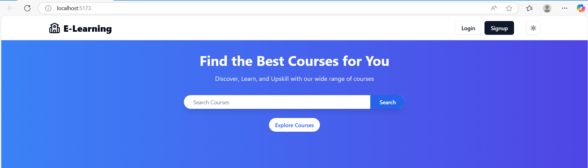
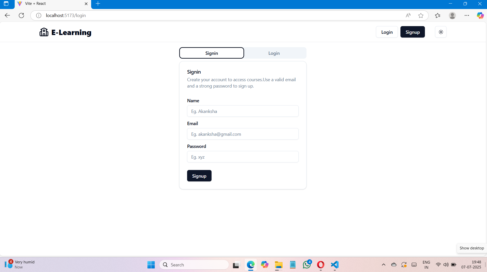
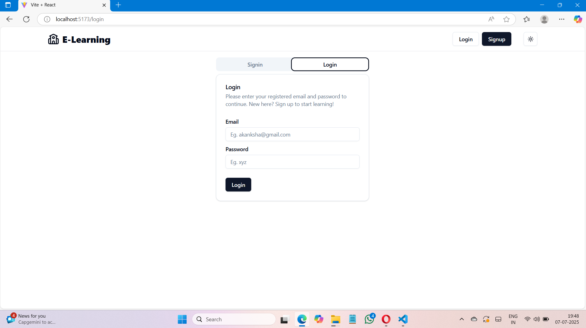
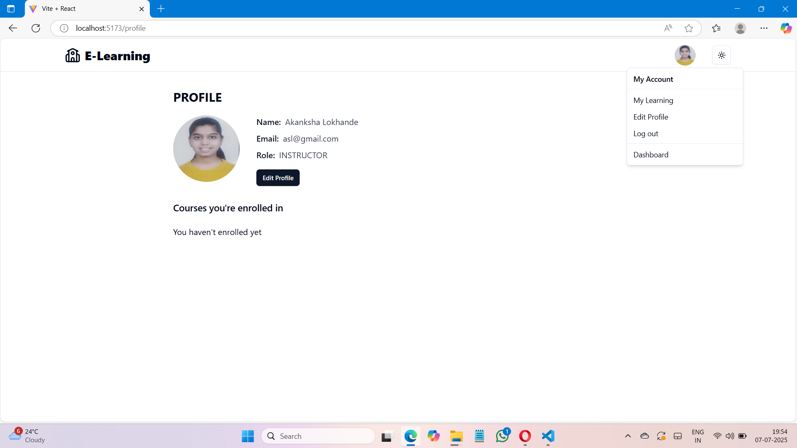
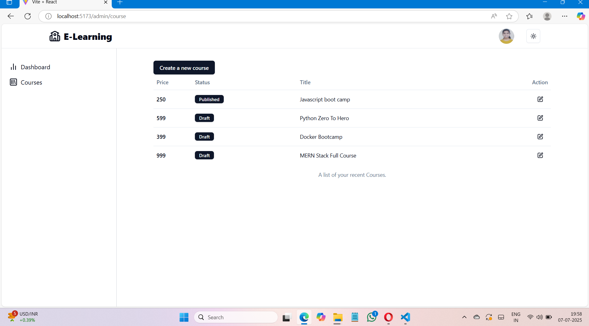
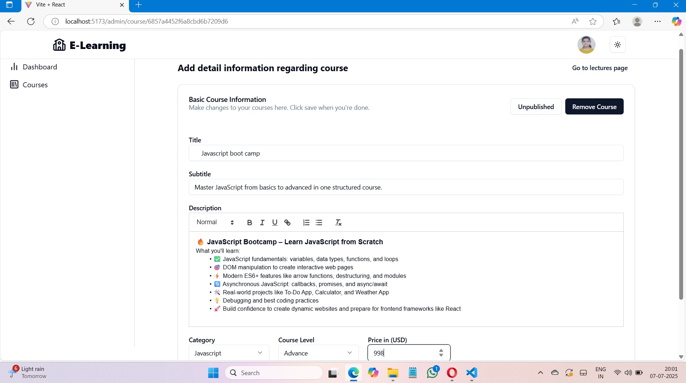
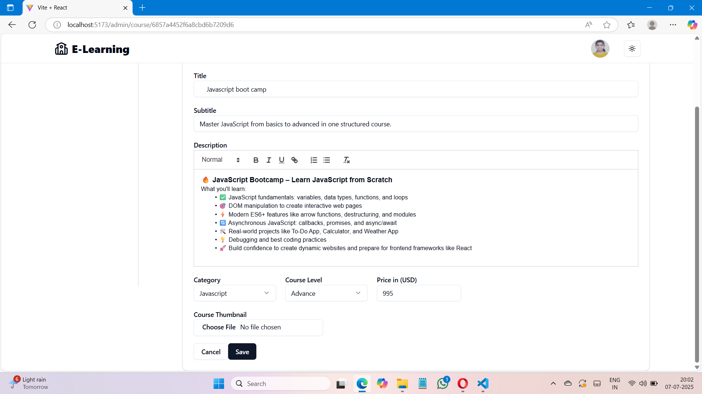
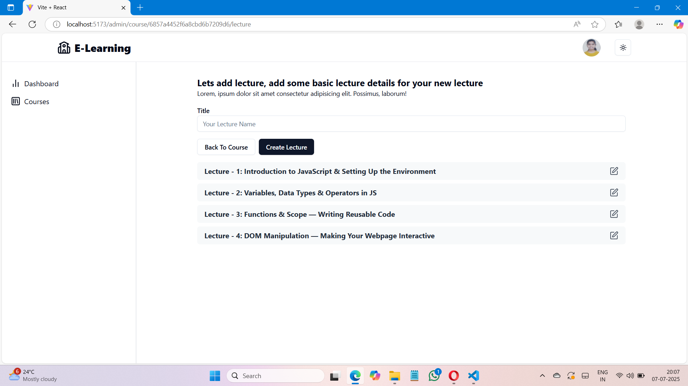
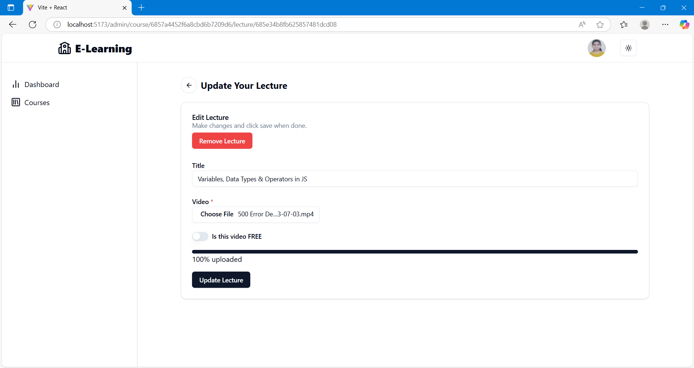
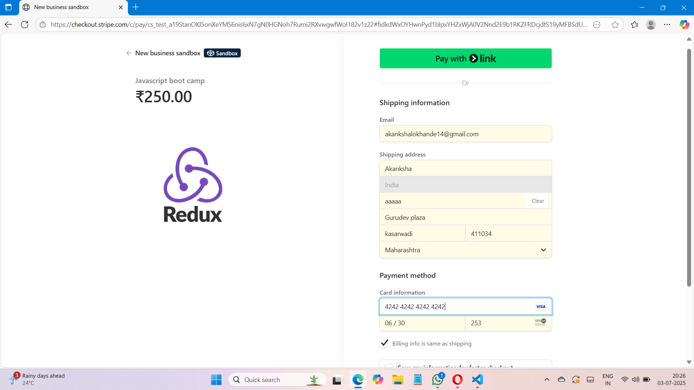

# 🎓 Online Course Store

An **Online Course Store** is a full-stack web application built with the **MERN stack** (MongoDB, Express.js, React, Node.js).  
It allows **instructors** to create and sell courses, and **learners** to browse, purchase, and access educational content.

---

## 🚀 Features

### 👩‍🏫 For Instructors
- Secure authentication & authorization
- Add new courses with title, description, price, and media (thumbnail/video)
- Manage and update existing courses

### 👩‍🎓 For Learners
- Create an account and login
- Browse all available courses
- Search and filter courses
- Purchase courses securely
- Access purchased courses in the dashboard

### 🌐 General Features
- Responsive UI with **React.js**
- RESTful API built using **Express.js**
- **MongoDB Atlas** / Local MongoDB for database
- **JWT Authentication** for secure login
- **Payment Integration** (Stripe)
- Modern UI design with reusable React components

---

## 🛠️ Tech Stack

**Frontend:**
- React.js (Hooks & Context API / Redux for state management)
- React Router for navigation
- TailwindCSS / Material UI (styling)

**Backend:**
- Node.js
- Express.js
- MongoDB + Mongoose (ODM)
- JWT & bcrypt for authentication

**Other Tools:**
- Axios for API requests
- Multer / Cloudinary (for image & video uploads)
- Stripe  (for payments)
- Postman (API testing)

---
## ⚙️ Installation & Setup

### 1️⃣ Clone the Repository
```bash
git clone https://github.com/your-username/online-course-store.git
cd online-course-store
```
###2️⃣ Setup Backend
```bash
- Create a .env file inside the server folder and add:

PORT=8080
##Mongodb Setup
MONGO_URI=
SECRET_KEY=
##cloudinary setup
API_KEY=
API_SECRET=
CLOUD_NAME=
#stripe setup
STRIPE_SECRET_KEY=
STRIPE_PUBLISHABLE_KEY=
WEBHOOK_ENDPOINT_SECRET=


cd server
npm install
npm run dev
```
###3️⃣ Setup Frontend
```bash
cd client
npm install
npm run dev
```
4️⃣ Access the App

Frontend: 👉 http://localhost:5173

Backend : 👉 http://localhost:8080

## 📸 Screenshots

### 🏠 Home Page


### 📝 Signup Page


### 🔑 Login Page


### 👤 Edit Profile Page


### 📚 Create Course Page


### ➕ Add Course Page



### 🎥 Add Lecture Page


### ✏️ Update Lecture Page


### 💳 Payment Page



